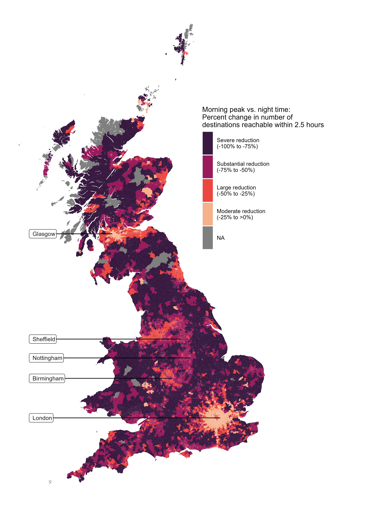
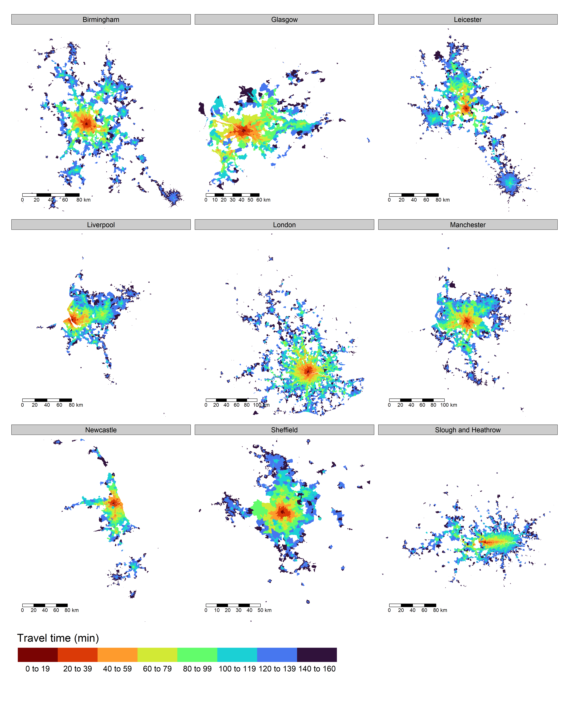
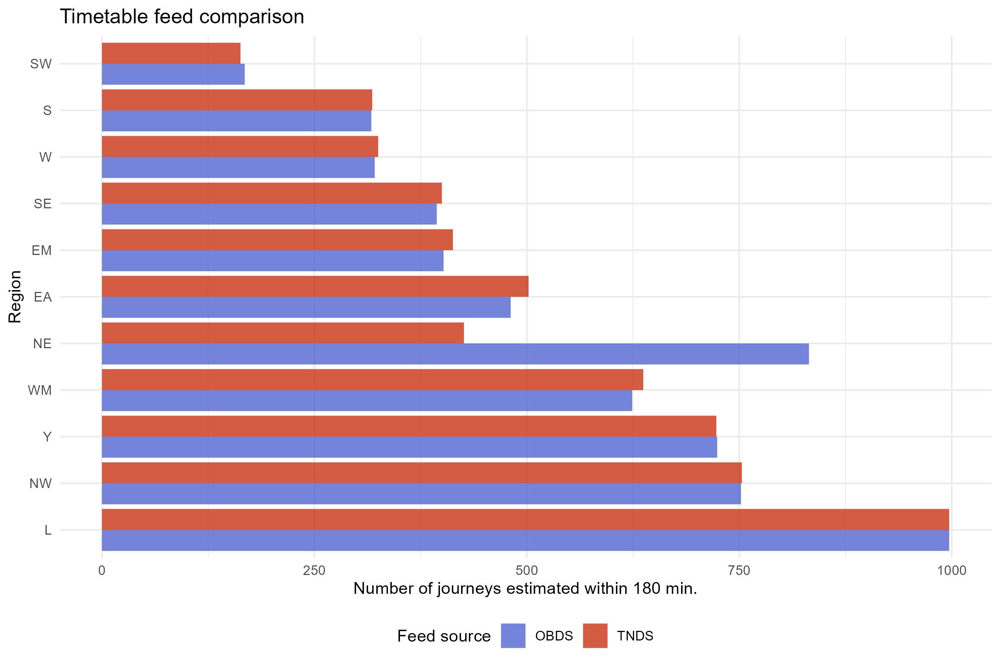
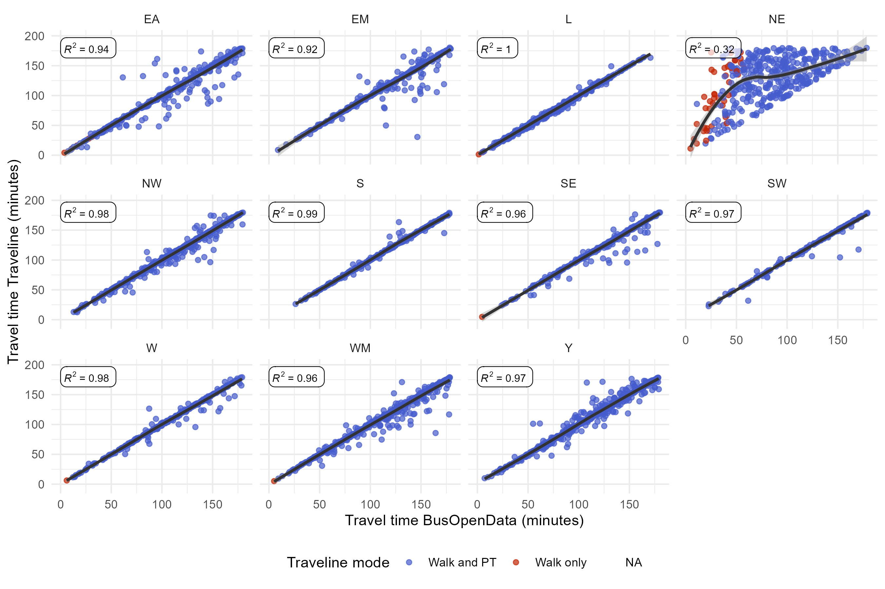

```{r setup, include=FALSE}
knitr::opts_chunk$set(echo = FALSE)
library(kableExtra)
```

# Background 

The estimated travel time from multiple origins to several potential destinations is a key input for the development of various regional and urban analyses. However, computing these values at a granular geographic level can be technically complex, time-consuming, and computationally intensive [@Conway2017; @Higgins2022]. This dataset provides ready-to-use door-to-door public transport travel time estimates for each of the 230,000 2011 Census output areas (OA) in Great Britain (GB) to every other OA reachable within 150 minutes during the morning peak for the year 2023. This information comprises an all-to-all travel time matrix (TTM) at the national level. In addition, the dataset includes two more TTMs at the lower super output area (LSOA) and the data zone (DZ) levels (42,000 LSOA/DZ units in total). These are estimated for two times of departure, specifically during the morning peak and at night. Altogether, these TTMs present a range of opportunities for researchers and practitioners, such as the development of accessibility measures, spatial connectivity or modifiable areal/temporal unit problem analyses, and the evaluation of public transport service changes throughout a day.

This dataset is related to the 'Public Transport Accessibility Indicators 2022' (PTAI) dataset [@VerduzcoTorres2022; @VerduzcoTorres2022a]. The PTAI is openly available from the following links: <https://zenodo.org/record/8037156> and <http://ubdc.gla.ac.uk/dataset/public-transport-accessibility-indicators-2022/resource/9dc1517f-afd5-4cfe-bbee-5315483fab72>. The LSOA/DZ TTM provided in this iteration is comparable to the TTM offered in the PTAI 2022. Please note that despite being published in 2022, the estimates in PTAI 2022 utilized data corresponding to November 2021.

# Method{#method}

## Geographies

The designated points representing origins and destinations are the respective population-weighted centroids (PWC) for OA or LSOA/DZ geographies. For this dataset, we employ the definitions corresponding to the 2011 Census.

The PWC data for Scottish OAs were accessed from the National Records of Scotland digital platform (<https://www.nrscotland.gov.uk/statistics-and-data/geography/our-products/census-datasets/2011-census/2011-boundaries>) in May 2023. The PWC data related to DZs were obtained from the Government Digital Service (GDS) platform in December 2023 (<https://data.gov.uk/dataset/8aabd120-6e15-41bf-be7c-2536cbc4b2e5/data-zone-centroids-2011>). In total, 227,759 origins were considered at the OA level.

The location of the PWC for OAs in Wales and England was sourced from the Office for National Statistics (ONS) in May 2023 (<https://geoportal.statistics.gov.uk/datasets/ons::output-areas-dec-2011-pwc/explore>). Meanwhile, the LSOA PWC data were accessed from the GDS in December 2021 (<https://data.gov.uk/dataset/a40f54f7-b123-4185-952f-da90c56b0564/lower-layer-super-output-areas-december-2011-population-weighted-centroids>). There are 42,72 LSOA/DZ considered as origins.

## Travel times

The travel times were estimated using `R5R` package software version '1.0.1' [@R-r5r] for `R` programming language. This is an enhanced `R` implementation of the Conveyal R5 Routing Engine (<https://github.com/conveyal/r5>) [@Conway2018; @Conway2019]. The main inputs used are public transport timetables and the road network. This was done using a single graph for GB. This model enables multi-modal door-to-door journeys which can include a combination of pedestrian and on-vehicle journey stages.

The timetable data are drawn from two sources. The first is the Rail Delivery Group (<https://data.atoc.org/data-download>), which mainly covers heavy rail services, e.g. regional trains in GB. The data used were published for the week corresponding to the 4th of March 2023 and downloaded on the 7th of March 2023. This data, originally accessed in CIF format, was then organized into the general transport feed specification (GTFS) using the `uk2gtfs` package for `R` [@Morgan2022a]. The second timetable source is the Bus Open Data Service (BODS, <https://www.bus-data.dft.gov.uk/>), which primarily includes local services across various transport modes, such as bus, tram, and ferry. The BODS data, downloaded in GTFS format on the 7th of March 2023, comes from operating companies and is supplemented by additional sources like Traveline (<https://www.travelinedata.org.uk/>). We compared the BODS data and the Traveline National Dataset (TNDS), both of which aim to provide equivalent information. [Appendix 1](#appedix-comparison) shows the results of this comparison, which suggest a high level of consistency. However, transforming TNDS from TransXChange to GTFS format leads to some information loss in our specific case. Thus, we preferred to use the data provided by BODS.

The road and pedestrian network used was sourced from OpenStreetMap and accessed from the GeoFrabrik (<https://download.geofabrik.de/>) platform. The data was manually downloaded for the whole GB in `.osm.pbf` format on May 2023. The files were filtered to keep only the relevant features for public transport routing (see script `R/00_prepare_osm.sh`).

### Routing parameters

The maximum duration of a journey considered in this dataset was set to 150 minutes. The mode is specified is a combination of walking and public transport (defined as `c('WALK', 'TRANSIT')` in the software). The maximum access/egress walking time to/from public transport stations is unlimited as long as it does not exceed the maximum duration. This implies that some routes can be completed only by walking if there are no public transport services available. The walking speed defined was 4 km/h. The maximum number of public transport rides (on-vehicle) was set to 3, which allows a maximum of two transfers.

The travel time via public transport can fluctuate depending on the operational characteristics of the services and the time of departure chosen [@Conway2018]. To account for this variability, we considered a three-hour time window. The output representing the travel time in this dataset corresponds to the 25th, 50th, and 75th percentiles of the options available within this time span (for more details, see the Conveyal R5 user manual <https://docs.conveyal.com/analysis/configuration>).

The date of departure set for all travel times in this dataset is the 7th of March 2023. The departure time for the OA TTM is 7 a.m. (effectively, from 7 to 10 a.m., considering the three-hour time window). For the TTM at the LSOA/DZ level, the departure times are 7 a.m. and 9 p.m. (or between 7 to 10 a.m. and 9 p.m. to 12 a.m., respectively).

# Data records

The TTMs are organized in a row matrix format, where each row represents a unique origin-destination pair. The TTMs are offered in `.duckdb` and `.parquet` file formats. Each database contains a single table called 'ttm_pt'.

The LSOA/DZ TTM consists of six columns and 265 million rows, and it can be accessed from the following file directories: `ttm/lsoa/ttm_lsoa.duckdb` and `ttm/lsoa/ttm_lsoa.parquet`. The structure of the records is displayed in the table below:

```{r lsoa-desc}
caption_losadesc <- "LSOA/DZ travel time matrix description."
desc_lsoa <- read.csv('output/ttm/lsoa/descrip_ttm.csv')
desc_lsoa %>% 
  kbl(caption = caption_losadesc) %>%
  kable_styling(bootstrap_options = c("striped", "hover"))
```

The OA TTM consists of five columns and 4.8 billion rows. The data is consolidated into a single database in `.duckdb` format at `ttm/oa/ttm_lsoa.duckdb`. It's also available in a series of `.parquet` files in the `ttm/oa/` directory. The data is organized into 1,519 consecutive files, ranging from `ttm_part-1` to `ttm_part-1519`. Each of these files contains the travel times from 150 origins to all their corresponding destinations. The structure of the records is presented in the table below.

```{r oa-desc}
caption_oadesc <- "OA travel time matrix description."
desc_oa <- read.csv('output/ttm/oa/descrip_ttm.csv')
desc_oa %>% 
  kbl(caption = caption_oadesc) %>%
  kable_styling(bootstrap_options = c("striped", "hover"))
```

# Usage notes

Given the considerable size of the TTM, it is often impractical to load the records into memory. Therefore, we recommend using a database management system (DBMS). For the following examples, we utilize DuckDB (<https://duckdb.org/>). This is an in-process (serverless) DBMS designed to support analytical query workloads (OLAP) in Structured Query Language (SQL). This alleviates memory limitations. DuckDB, implemented in `C++`, can be executed from `R` through the `duckdb` package. We provide a few examples in the sections below.

## Extracting and summarising LSOA/DZ travel time matrix data

As an illustrative example, we perform a basic data extraction and summary. This examines the fluctuation of the public transport services across the day. We compute a measure that reflects the relative change between nighttime and morning peak service availability. This is calculated as the percentage change between the number of destinations reachable within 150 minutes at night and the morning peak. The snippet below showcases the workflow to achieve this from `R`.

```{r echo=TRUE, eval=FALSE}
# Load packages -----------------------------------------------------------

library(DBI)
library(duckdb)
library(dplyr)

# Establish connection ----------------------------------------------------

# Define the database file path
db_file <- "ttm/lsoa/ttm_lsoa.duckdb"
# Connect to the DuckDB
con <- dbConnect(duckdb::duckdb(), db_file)

# Extract data from DuckDB ----------------------------------------------

# Query and summarize the data by origin and time of the day using SQL
ttm_summary <- dbGetQuery(con, "
  SELECT from_id, 
         time_of_day, 
         COUNT(*) AS count,
  FROM ttm_pt
  GROUP BY from_id, time_of_day
")

# Estimate percent change
dest_difference <- ttm_summary %>% 
  pivot_wider(
    names_from = time_of_day, 
    values_from = c(count, median_travel_time)
  ) %>% 
  mutate(
    # NA if number of destinations is too low
    count_am = if_else(count_am <= 5, NA, count_am),
    # Compute the percentage chance
    difference_dest_pct = (count_pm / count_am - 1) * 100
  )

# Close the DB connection
dbDisconnect(con)
```

In this example, the data is summarized and extracted through an SQL query, and then the result is imported into the session as a data frame. The processing time for the query is approximately one second. Once we have a manageable summary, the rest of the process follows the usual `R` workflow (using `dplyr` verbs in this instance).

The LSOA/DZ boundaries, available at 'InFuse' platform (<https://infuse.ukdataservice.ac.uk/>) [@OfficeForNationalStatistics2017], can be joined to the results and plotted in a map. This is shown in the figure below.



It should be noted that the number of destinations reachable corresponds to the the 25th percentile travel time, as the SQL query disregards the NA values present in other travel time percentiles.

## Extracting and summarising OA travel time matrix data

The workflow for processing the OA TTM is similar to the one shown in the previous section. However, the processing times might be considerably longer due to the larger size of the matrix. The computing time will depend on the complexity of the query and the computing resources used.

In the following example, the first query generates a summary grouped by the origin (by OA code), which counts the number of estimated for different time thresholds at the 50th percentile. The second part simply subsets the TTM for a single specific origin or multiple origins.


```{r echo=TRUE, eval=FALSE}

# Pacakges ----------------------------------------------------------------

library(DBI)
library(duckdb)
library(dplyr)


# Establish a connection to the DB ----------------------------------------

# Define the DuckDB database file
db_file <- "ttm/oa/ttm_oa.duckdb"
# Connect to the DuckDB database
con <- dbConnect(duckdb::duckdb(), db_file)


# Summary by origin --------------------------------------------------------

# Count number of destinations available at various timecuts
cum_summary <- dbGetQuery(con, "
      SELECT from_id,
             COUNT_IF(travel_time_p50 <= 30) AS count_30,
             COUNT_IF(travel_time_p50 <= 60) AS count_60,
             COUNT_IF(travel_time_p50 <= 120) AS count_120,
             COUNT(*) AS count_all
      FROM ttm_pt
      WHERE travel_time_p50 IS NOT NULL
      GROUP BY from_id
    ")

# Extract travel times -----------------------------------------------------

# Extract travel times from a single origin 
singleorigin_query <- dbGetQuery(con, "
    SELECT *
    FROM ttm_pt
    WHERE from_id = 'E00004187'
  ")

# Extract travel time from multiple origins
# Define OA codes to extract the data from
oa_code_str <- 
 "('E00004667','E00176055','E00175644','E00166680','S00116383','E00175585','E00176659','E00169534','E00172508')"

# Pass SQL query
filtered_query <- dbGetQuery(con, sprintf("
    SELECT *
    FROM ttm_pt
    WHERE from_id IN %s
  ", oa_code_str))


# Close the DB connection
dbDisconnect(con)
```

The execution time for the summary was approximately 17 seconds, while the data extraction for a single origin and multiple origins took less than a second and 6.7 minutes, respectively.

The multiple OA codes used in the example above are only nine origins located in central areas of the larger cities in GB out of the 230,00 ones estimated at this level. We can combine the OA boundaries from the InFuse dataset with the estimated trip duration and map these as isochrones. This is illustrated in the figure below.



# Code availability

All the code used to create the dataset is available at the following public GitHub repository: <https://github.com/urbanbigdatacentre/ttm_greatbritain>.

## System and software details

R version 4.3.0 (2023-04-21 ucrt)
Platform: x86_64-w64-mingw32/x64 (64-bit)
Running under: Windows 10 x64 (build 19044)

Matrix products: default

locale:
  [1] LC_COLLATE=English_United Kingdom.utf8  LC_CTYPE=English_United Kingdom.utf8
[3] LC_MONETARY=English_United Kingdom.utf8 LC_NUMERIC=C
[5] LC_TIME=English_United Kingdom.utf8

time zone: Europe/London
tzcode source: internal

attached base packages:
  [1] stats     graphics  grDevices utils     datasets  methods   base

other attached packages:
  [1] arrow_12.0.1    sf_1.0-12       lubridate_1.9.2 forcats_1.0.0   stringr_1.5.0
[6] dplyr_1.1.2     purrr_1.0.1     readr_2.1.4     tidyr_1.3.0     tibble_3.2.1
[11] ggplot2_3.4.2   tidyverse_2.0.0 r5r_1.0.1

loaded via a namespace (and not attached):
  [1] bit_4.0.5          gtable_0.3.3       compiler_4.3.0     tidyselect_1.2.0   Rcpp_1.0.10
[6] assertthat_0.2.1   scales_1.2.1       R6_2.5.1           generics_0.1.3     classInt_0.4-9
[11] units_0.8-2        munsell_0.5.0      DBI_1.1.3          pillar_1.9.0       tzdb_0.3.0
[16] rlang_1.1.1        utf8_1.2.3         stringi_1.7.12     bit64_4.0.5        timechange_0.2.0
[21] cli_3.6.1          withr_2.5.0        magrittr_2.0.3     class_7.3-21       grid_4.3.0
[26] rstudioapi_0.14    hms_1.1.3          lifecycle_1.0.3    vctrs_0.6.2        KernSmooth_2.23-20
[31] proxy_0.4-27       glue_1.6.2         data.table_1.14.8  e1071_1.7-13       fansi_1.0.4
[36] colorspace_2.1-0   tools_4.3.0        pkgconfig_2.0.3


# Acknowledegements

This is a work developed at the [Urban Big Data Centre](https://www.ubdc.ac.uk/) of the University of Glasgow and it is supported by Economic and Social Research Council (ESRC) (Grant No. ES/S007105/1).

# Appendix A. Timetable data comparison{#appedix-comparison}

For the comparison, we constructed two alternative graphs using the information from TNDS and BODS, both of which include regional train services from the Rail Delivery Group.

We selected 1,000 random stops included in the TNDS dataset as origins and another 1,000 representing destinations for each region. We then ran equivalent route estimates using similar parameters described in the [Method](#method) section, except that the maximum duration was increased to 180 minutes.

The figure below compares the total number of routes generated using the alternative feed sources. The total number of estimated routes is very similar for most regions, with few cases where one source produced more routes than the other. The exception is North East (NE) England, where BODS resulted in almost twice the number of routes.



The following figure presents a comparison of travel times using the two alternative sources, broken down by region. As observed before, the estimates are very similar to each other, especially for London. The notable exception is North East (NE), where all travel time estimates derived from the TNDS are longer than those generated using the BODS data.



In summary, both sources produce consistent estimates. The significant differences observed for the NE are due to data loss during the transformation process from TransXChange to GTFS format. Hence, we decided to utilize the data provided by the BODS as it proved to be a more stable source in our case.

# References
